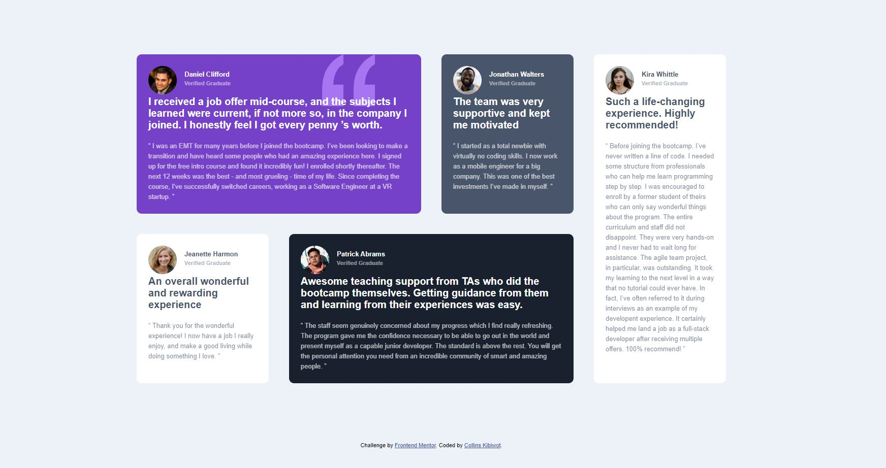

# Frontend Mentor - Testimonials grid section solution

This is a solution to the [Testimonials grid section challenge on Frontend Mentor](https://www.frontendmentor.io/challenges/testimonials-grid-section-Nnw6J7Un7). Frontend Mentor challenges help you improve your coding skills by building realistic projects. 

## Table of contents

- [Overview](#overview)
  - [The challenge](#the-challenge)
  - [Screenshot](#screenshot)
  - [Links](#links)
- [My process](#my-process)
  - [Built with](#built-with)
  - [What I learned](#what-i-learned)
  - [Continued development](#continued-development)
  - [Useful resources](#useful-resources)
- [Author](#author)
- [Acknowledgments](#acknowledgments)


## Overview

### The challenge

Users should be able to:

- View the optimal layout for the site depending on their device's screen size

### Screenshot




### Links

- Solution URL: [GitHub](https://github.com/kibiwotkosgei/testimonials-grid.git)
- Live Site URL: [Add live site URL here](https://your-live-site-url.com)

## My process

### Built with

- Semantic HTML5 markup
- CSS custom properties
- Flexbox
- CSS Grid
- Desktop-first workflow


### What I learned

I learned about the grid property.It is very amazing.

```html
<h1>Some HTML code I'm proud of</h1>
<div class="grid-item grid-item-2">
  <div class="header">
  
  <div class="testimonyimage"></div>

  <div class="names"><h1>Jonathan Walters </h1> <h2>Verified Graduate</h2> </div>
</div>

  <div class="firstparagraph"><p>
  The team was very supportive and kept me motivated</p>
</div>
<div class="secondparagraph">
 <p> “ I started as a total newbie with virtually no coding skills. I now work as a mobile engineer 
  for a big company. This was one of the best investments I’ve made in myself. ”
</p></div>
</div>

```
```css
.proud-of-this-css {
  .grid-item-1 {
  background: url("./images/bg-pattern-quotation.svg") no-repeat top right 20%;
  background-color: var(--Moderateviolet);
  color: var(--White);
  grid-column-start: 1;
  grid-column-end: 3;

  @media only screen and (max-width: 750px) {
  .grid-container {
    display: block;
  }
}
```

### Continued development

I would like to keep practising working with grid property in the near future.Also practise on using @meadia to scale up and scale down.


### Useful resources

- [w3schools](https://www.w3schools.com) - This helped me in working on pushing a row to the far end. I really liked it and will use it going forward.
- [developer.mozilla.org](https://developer.mozilla.org/) - I am still learning the great concepts I learned from this great website.


## Author


- Frontend Mentor - [@kibiwotkosgei](https://www.frontendmentor.io/profile/kibiwotkosgei)
- GitHub - [@kibiwotkosgei](https://github.com/kibiwotkosgei)


## Acknowledgments

I would like to recognize efforts of my friends [Lesley Kimutai](https://www.frontendmentor.io/profile/Leskim) and [Collins Kibenon](https://www.frontendmentor.io/profile/collinskibenon).I asked them many questions especially Collins Kibenon who almost got pissed of,but do I care? Maneuvering through github is now smooth for me thanks to them.Their solutions were very insightful though I greatly differed from them.

[Lesley Kimutai] inspired me to write my first README file.

I also acknowlegde frontendmentor for this great platform.
